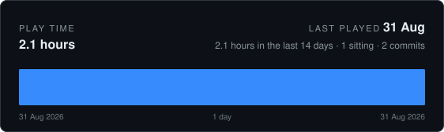

<!-- CODING-TIME:START -->



<details>
<summary>How this is counted</summary>

Commits record when work was saved, never how long it took, so this is an
estimate rather than a timesheet. Commits less than 120 minutes apart
count as one sitting and contribute the real time between them; a commit that
opens a sitting contributes a flat 120 minutes for the work that led up to
it. Merges are skipped, and nothing that was never committed is visible here.

Covers every author. Regenerated on each commit by `.githooks/coding-time`,
which reads commit timestamps and nothing else. `GAP_MINUTES`, `OPENING_MINUTES`,
`RECENT_DAYS` and `DAYS` change what it assumes.

</details>

<!-- CODING-TIME:END -->

# EconBoxServer

The simulation and rendering server behind **EconBox**.

The split is the whole idea: **the server owns every number, the client owns
every pixel.** A client asks for a frame at a given size and gets back a flat
list of drawing commands — rectangles, lines, circles, text — which it paints in
order. It never runs the economy, never picks a colour, never computes an axis.

```
  EconBox client                          EconBoxServer
  ------------------                      -----------------------------------
  POST /api/frame  -------------------->  sim::World::step   (the economy)
  {width, height, advance}                render::build      (layout, colour)
                   <--------------------  {ops: [ ... ]}
  paint ops on a canvas
```

That makes clients trivial: the reference client in [`web/index.html`](web/index.html)
is about 150 lines of JavaScript, and most of it is the five painting functions.
Porting EconBox to another platform means writing those five functions again,
not porting the model.

Written in Rust with **no dependencies at all** — HTTP, JSON and the random
number generator are hand-written under `src/`, so there is nothing between you
and the code you want to change.

## Quick start

```bash
cargo run --release
```

Then open <http://127.0.0.1:8080/>. You should see a live economy: a price
series with visible booms and slumps, the demand and supply flows behind it, the
wealth distribution, and every agent as a dot.

Try this first: drag the **tax** slider up. Every agent pays that share of its
cash each tick and gets an equal dividend back, so the wealth histogram
collapses toward a single bar within a few hundred ticks. Drag it back to zero
and inequality creeps outward again.

## The API in one screen

```bash
curl localhost:8080/api/health                                    # liveness
curl localhost:8080/api/state                                     # the numbers
curl -X POST localhost:8080/api/step   -d '{"ticks":100}'         # advance time
curl -X POST localhost:8080/api/frame  -d '{"width":1280,"height":720,"advance":1}'
curl -X POST localhost:8080/api/params -d '{"tax_rate":0.01}'     # tune it
curl -X POST localhost:8080/api/reset  -d '{"seed":7,"agents":500}'
```

| Method | Path            | Purpose                                            |
| ------ | --------------- | -------------------------------------------------- |
| `GET`  | `/`             | The reference client, embedded in the binary       |
| `GET`  | `/api/health`   | Liveness, version and frame protocol version       |
| `GET`  | `/api/state`    | Tick, price, parameters and aggregate totals       |
| `GET`  | `/api/history`  | The last N recorded ticks                          |
| `GET`  | `/api/frame`    | A frame, read-only                                 |
| `POST` | `/api/frame`    | Advance the world and return the frame             |
| `GET`  | `/api/params`   | Current simulation parameters                      |
| `POST` | `/api/params`   | Patch parameters; absent fields are left alone     |
| `POST` | `/api/step`     | Advance the world without rendering                |
| `POST` | `/api/reset`    | Rebuild the world from a seed                      |

Full reference with request and response bodies: **[docs/API.md](docs/API.md)**.

## Configuration

Flags beat environment variables, which beat the defaults.

| Flag        | Environment        | Default          | Meaning                     |
| ----------- | ------------------ | ---------------- | --------------------------- |
| `--addr`    | `ECONBOX_ADDR`     | `127.0.0.1:8080` | Address to listen on        |
| `--agents`  | `ECONBOX_AGENTS`   | `240`            | Population size (max 20000) |
| `--seed`    | `ECONBOX_SEED`     | `42`             | Simulation seed             |
| `--workers` | `ECONBOX_WORKERS`  | `2 x CPU cores`  | Request worker threads      |

The seed defaults to a fixed value on purpose: the same seed and the same
sequence of calls always produce exactly the same run.

```bash
econbox-server --addr 0.0.0.0:8080 --agents 2000 --seed 7
```

## Writing your own client

A client needs to do exactly two things: keep a clock, and paint ops.

```js
const scene = await fetch('/api/frame', {
  method: 'POST',
  headers: { 'content-type': 'application/json' },
  body: JSON.stringify({ width: 1280, height: 720, advance: 1 }),
}).then((response) => response.json());

ctx.fillStyle = scene.background;
ctx.fillRect(0, 0, scene.width, scene.height);
for (const op of scene.ops) {
  if (op.op === 'rect') { ctx.fillStyle = op.fill; ctx.fillRect(op.x, op.y, op.w, op.h); }
  // ... circle, line, polyline, text
}
```

The frame format — every op, every field, the coordinate system, and the rules
for staying compatible — is specified in **[docs/RENDERING.md](docs/RENDERING.md)**.

## What the economy actually does

Agents produce a single good, consume it, and trade the difference at one market
price. Production responds to the price, desired inventory responds to the
price, and the price responds to excess demand — so the market has a real supply
curve, a real demand curve, and an equilibrium to return to. An economy-wide
productivity process gives it a business cycle.

Money is conserved exactly: no tick creates or destroys a unit of cash, and
there is a test that says so. The full model, with equations, is in
**[docs/SIMULATION.md](docs/SIMULATION.md)**.

## Project layout

```
src/
  main.rs        the binary: configure, build a world, serve
  lib.rs         the library root and the module map
  api.rs         routing and one handler per endpoint
  config.rs      defaults, environment, command line
  json.rs        a JSON value, parser and serializer
  rng.rs         deterministic random numbers
  http/          request parsing, responses, thread pool, accept loop
  sim/           agents, market clearing, the world and its tick
  render/        drawing commands, and the layout that produces them
web/index.html   the reference client, embedded into the binary
tests/economy.rs end-to-end checks that the model stays healthy
docs/            architecture, API, rendering protocol, simulation model
```

## Development

```bash
cargo test                 # unit tests plus the economy checks
cargo clippy --all-targets # expected to be silent
cargo fmt --check
cargo test --test economy -- --nocapture   # print the shape of a default run
```

The repository keeps its hooks in `.githooks`, which git only looks at once it
has been told to. One command, once per clone:

```bash
git config core.hooksPath .githooks
```

That is what keeps the play time card at the top of this file current. Nothing
depends on it — a clone without it builds and tests exactly the same.

## Documentation

- **[docs/ARCHITECTURE.md](docs/ARCHITECTURE.md)** — how the pieces fit, what is
  deliberately missing, and where to extend
- **[docs/API.md](docs/API.md)** — every endpoint, with examples
- **[docs/RENDERING.md](docs/RENDERING.md)** — the frame protocol, and how to
  write a client for it
- **[docs/SIMULATION.md](docs/SIMULATION.md)** — the economic model and its
  parameters
- **[CONTRIBUTING.md](CONTRIBUTING.md)** — recipes for adding an endpoint, a
  drawing op or a panel

## Status and scope

Version 0.1. It runs one world, in memory, over plain HTTP, with no
authentication. That is enough for a local sandbox and for a client on the same
machine; it is not enough to expose to the internet as-is. See
[docs/ARCHITECTURE.md](docs/ARCHITECTURE.md#deliberate-omissions) for the list of
what is missing and why.

## License

MIT — see [LICENSE](LICENSE).
